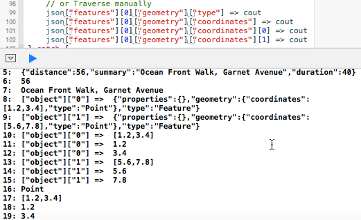
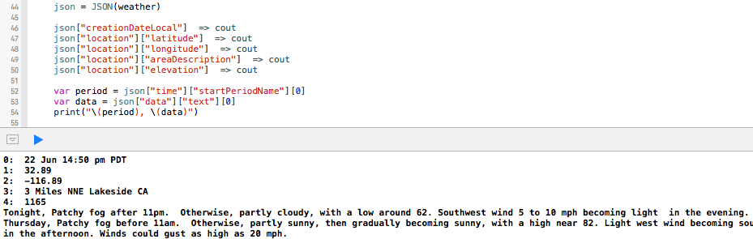

# playgrounds
Playgrounds for Swift 2.2 and Swift 3.0

Playground for consuming GeoJson using [swift-json](https://github.com/dankogai/swift-json)

GeoJson on Swift

Json from Weather.gov on Swift

